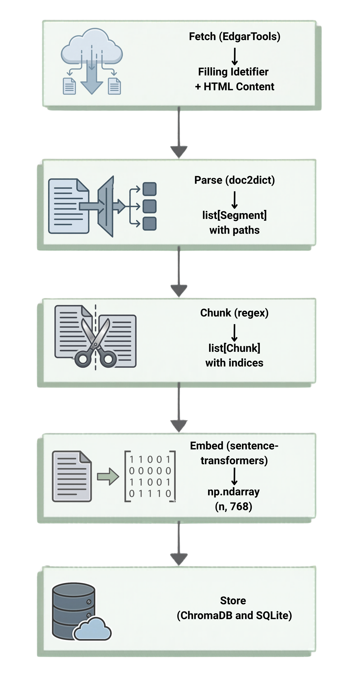
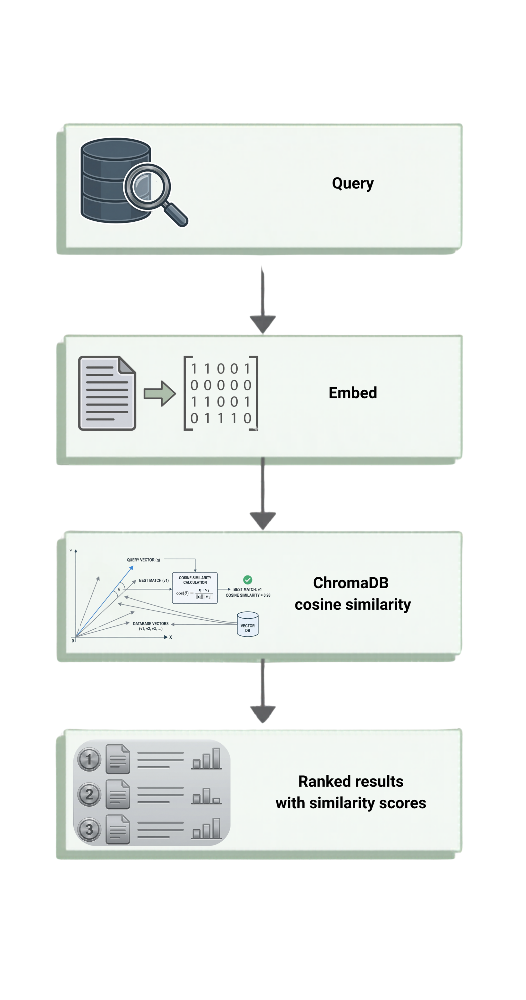

# SEC-SemanticSearch

A **semantic search system** for SEC filings (10-K, 10-Q). Fetches filings from EDGAR, parses them into meaningful segments, embeds them with a local GPU-accelerated model, and retrieves the most relevant passages for any natural language query.

This is a **vector similarity search** system — not RAG. No language model generates answers; the system returns the actual filing text that best matches your query.

---

## How it works

<table>
  <tr>
    <td align="center" width="50%"></td>
    <td align="center" width="50%"></td>
  </tr>
</table>

---

## Features

- **Full pipeline** — Fetch, parse, chunk, embed, and store SEC filings in one command
- **GPU-accelerated embeddings** — Uses `google/embeddinggemma-300m` (768-dim) via sentence-transformers with CUDA support
- **Dual-store architecture** — ChromaDB for vector search, SQLite for relational metadata
- **Web application** — FastAPI backend + React/Next.js frontend with real-time WebSocket progress
- **Rich CLI** — Progress bars, colour-coded similarity output, formatted tables, contextual error hints
- **Privacy by design** — Search queries are never persisted; per-session EDGAR credentials are never stored server-side
- **Encryption at rest** — Optional SQLCipher encryption for the SQLite metadata database
- **Two-tier access control** — Separate API key and admin key; admin key never exposed in browser code
- **Demo mode** — FIFO eviction when the filing limit is reached; nightly reset notice in the UI
- **Flexible filtering** — Search and manage by ticker, form type, or date range
- **Duplicate detection** — Checks for existing filings before any GPU work begins
- **Configuration-driven deployment** — Three deployment scenarios (local, team, public) controlled entirely via environment variables
- **799 backend tests and 144 frontend tests**, all passing

---

## Requirements

- Python 3.12 or later
- NVIDIA GPU with CUDA support (recommended; CPU fallback available)
- [uv](https://docs.astral.sh/uv/) package manager (recommended)
- Node.js 22 or later (web frontend only)

---

## Installation

```bash
# Clone the repository
git clone https://github.com/ErenYanic/SEC-SemanticSearch.git
cd SEC-SemanticSearch

# Create and activate a virtual environment
uv venv .venv --python 3.12
source .venv/bin/activate

# Install the package
uv pip install .
```

To enable SQLCipher encryption for the SQLite metadata database (optional):

```bash
uv pip install ".[encryption]"
```

**For developers** (includes pytest, ruff, mypy):

```bash
uv pip install -e ".[dev]"
```

The `-e` flag installs in editable mode — source changes are reflected immediately without reinstalling.

### Configuration

Copy the environment template and fill in your SEC EDGAR credentials:

```bash
cp .env.example .env
```

The SEC requires a name and email in the User-Agent header of every EDGAR request.

**Required for CLI usage:**

| Variable | Description |
|----------|-------------|
| `EDGAR_IDENTITY_NAME` | Your name (SEC EDGAR identification) |
| `EDGAR_IDENTITY_EMAIL` | Your email address |

> For web deployments with `EDGAR_SESSION_REQUIRED=true`, these can remain unset — the frontend shows a session-start form where each user provides their own credentials.

**Commonly used optional variables:**

| Variable | Default | Description |
|----------|---------|-------------|
| `HUGGING_FACE_TOKEN` | — | HF token for faster model downloads |
| `EMBEDDING_MODEL_NAME` | `google/embeddinggemma-300m` | Sentence-transformer model |
| `EMBEDDING_DEVICE` | `auto` | `cuda`, `cpu`, or `auto` |
| `EMBEDDING_BATCH_SIZE` | `32` | Reduce for low-VRAM GPUs (e.g. `8`) |
| `DB_CHROMA_PATH` | `./data/chroma_db` | ChromaDB storage path |
| `DB_METADATA_DB_PATH` | `./data/metadata.sqlite` | SQLite metadata path |
| `DB_ENCRYPTION_KEY` | unset | SQLCipher key; unset = plain SQLite |
| `DB_MAX_FILINGS` | `500` | Maximum filings to store |
| `SEARCH_TOP_K` | `5` | Default number of search results |
| `API_KEY` | unset | General API access key; unset = no authentication |
| `ADMIN_API_KEY` | unset | Admin key for destructive operations |
| `LOG_REDACT_QUERIES` | `false` | Hash search queries and tickers in logs |
| `DEMO_MODE` | `false` | FIFO eviction + nightly-reset notice |

See [`.env.example`](.env.example) for the full variable list with descriptions.

---

## CLI

The `sec-search` command (or `python -m sec_semantic_search`) covers ingestion, search, and database management.

### Ingesting filings

```bash
# Latest 10-K and 10-Q for Apple
sec-search ingest add AAPL

# Only 10-Q filings
sec-search ingest add AAPL --form 10-Q

# 3 newest filings across all form types
sec-search ingest add AAPL --total 3

# 2 most recent 10-K filings
sec-search ingest add AAPL --number 2 --form 10-K

# Filings from a specific year
sec-search ingest add AAPL --year 2023

# Filings within a date range
sec-search ingest add AAPL --start-date 2022-01-01 --end-date 2023-12-31

# Multiple companies
sec-search ingest batch AAPL MSFT GOOGL

# Multiple companies, 3 newest each across forms
sec-search ingest batch AAPL MSFT --total 3
```

### Searching

```bash
# Basic semantic search
sec-search search "risk factors related to supply chain"

# Limit results and filter by ticker
sec-search search "revenue recognition" --top 10 --ticker AAPL

# Filter by form type
sec-search search "liquidity" --form 10-Q
```

Results appear in a Rich table with colour-coded similarity scores: green for ≥ 40%, yellow for ≥ 25%, and dim below that.

### Managing the database

```bash
# Database overview (filing count, chunk count, tickers)
sec-search manage status

# List all ingested filings
sec-search manage list

# Filter by ticker and/or form type
sec-search manage list --ticker AAPL --form 10-K

# Remove a single filing by accession number
sec-search manage remove 0000320193-24-000123

# Bulk remove all filings for a ticker
sec-search manage remove --ticker AAPL

# Bulk remove by ticker and form type
sec-search manage remove --ticker AAPL --form 10-K

# Skip the confirmation prompt
sec-search manage remove --ticker AAPL --yes

# Delete everything
sec-search manage clear
```

### Other options

```bash
sec-search --version
sec-search --verbose ingest add AAPL
```

---

## Python API

The package is also available programmatically.

### End-to-end: ingest and search

```python
from sec_semantic_search.pipeline import PipelineOrchestrator
from sec_semantic_search.database import ChromaDBClient, MetadataRegistry
from sec_semantic_search.search import SearchEngine

# 1. Process a filing (fetch → parse → chunk → embed)
orchestrator = PipelineOrchestrator()
result = orchestrator.ingest_latest("AAPL", "10-K")

print(f"Segments: {result.ingest_result.segment_count}")
print(f"Chunks:   {result.ingest_result.chunk_count}")
print(f"Time:     {result.ingest_result.duration_seconds:.1f}s")

# 2. Store in both databases (ChromaDB first, then SQLite)
chroma = ChromaDBClient()
chroma.store_filing(result)

registry = MetadataRegistry()
registry.register_filing(result.filing_id, result.ingest_result.chunk_count)

# 3. Search across all stored filings
engine = SearchEngine()
results = engine.search("risk factors related to supply chain")

for r in results:
    print(f"{r.similarity:.1%} — {r.ticker} {r.form_type} — {r.section_path}")
    print(r.content[:200])
    print()
```

### Search with filters

```python
from sec_semantic_search.search import SearchEngine

engine = SearchEngine()

results = engine.search(
    "revenue recognition policies",
    top_k=10,
    ticker="MSFT",
    form_type="10-K",
    min_similarity=0.25,
)
```

### Individual pipeline stages

```python
from sec_semantic_search.pipeline.fetch import FilingFetcher
from sec_semantic_search.pipeline import FilingParser, TextChunker

# Fetch without processing
fetcher = FilingFetcher()
filing_id, html = fetcher.fetch_latest("GOOGL", "10-Q")

# Parse HTML into segments
parser = FilingParser()
segments = parser.parse(filing_id, html)
print(f"Extracted {len(segments)} segments")

# Chunk segments for embedding
chunker = TextChunker()
chunks = chunker.chunk_segments(segments)
print(f"Produced {len(chunks)} chunks")
```

### Database management

```python
from sec_semantic_search.database import MetadataRegistry, ChromaDBClient

registry = MetadataRegistry()
chroma = ChromaDBClient()

# List stored filings
for record in registry.list_filings(ticker="AAPL"):
    print(f"{record.ticker} {record.form_type} — {record.filing_date}")

# Check counts
print(f"Filings: {registry.count()}")
print(f"Chunks:  {chroma.collection_count()}")

# Remove a filing from both stores
accession = "0000320193-24-000123"
deleted = chroma.delete_filing(accession)
registry.remove_filing(accession)
print(f"Removed {deleted} chunks")
```

---

## Web application

A full web interface built with FastAPI (backend) and React/Next.js 16 (frontend).

### Running in development

**1. Start the API server:**

```bash
# From the project root (with virtual environment active)
sec-search-api
# or: uvicorn sec_semantic_search.api.app:app --reload --port 8000
```

**2. Start the frontend dev server:**

```bash
cd frontend
npm install
npm run dev
```

The frontend runs on `http://localhost:3000` and proxies API requests to `http://localhost:8000`.

### Pages

- **Dashboard** — Filing count, chunk count, form-type chart, ticker table with navigation to filtered views
- **Search** — Semantic search with filters (ticker, form type, similarity threshold, top-k), expandable results with clipboard copy, collapsible filing inventory
- **Ingest** — Tag-style ticker input, form type selection, real-time WebSocket progress per filing, cancel support, active-task recovery on page load
- **Filings** — Sortable and filterable table, pagination, multi-select, individual and bulk delete, URL-based filter persistence

Additional: dark/light theme, CSS-only loading skeletons, skip-to-content, keyboard navigation, ARIA attributes, custom 404 and error boundary pages.

### API endpoints

| Method | Path | Auth | Description |
|--------|------|------|-------------|
| GET | `/api/status/` | API key | Database overview |
| GET | `/api/filings/` | API key | List filings (with filters) |
| DELETE | `/api/filings/{accession}` | API key | Delete single filing |
| POST | `/api/filings/bulk-delete` | Admin key | Bulk delete by filter |
| DELETE | `/api/filings/` | Admin key | Clear all filings |
| POST | `/api/search/` | API key | Semantic search |
| POST | `/api/ingest/add` | API key | Start single-ticker ingestion |
| POST | `/api/ingest/batch` | API key | Start multi-ticker ingestion |
| GET | `/api/ingest/tasks` | API key | List ingestion tasks |
| DELETE | `/api/ingest/tasks/{task_id}` | API key | Cancel running task |
| GET | `/api/resources/gpu` | API key | GPU/model status |
| DELETE | `/api/resources/gpu` | Admin key | Unload GPU model |
| WS | `/ws/ingest/{task_id}` | API key | Real-time ingestion progress |

Full interactive documentation is available at `http://localhost:8000/docs` when the server is running.

### Production deployment

> **HTTPS is required for team and public deployments.** Without TLS, API keys, per-session EDGAR credentials, and search queries cross the network in plaintext.

**Option 1 — Reverse proxy (recommended):**

```
Client ──HTTPS──▶ nginx (TLS) ──HTTP──▶ sec-search-api (127.0.0.1:8000)
```

**Option 2 — Direct TLS via uvicorn:**

```bash
sec-search-api --ssl-certfile cert.pem --ssl-keyfile key.pem
```

**Recommended settings for public deployments:**

- Set `API_KEY` to a strong random value
- Set `ADMIN_API_KEY` separately for destructive operations
- Set `DB_ENCRYPTION_KEY` to enable SQLCipher encryption on the SQLite database
- Set `LOG_REDACT_QUERIES=true` to hash search queries and tickers in logs
- Set rate limits via `API_RATE_LIMIT_*` environment variables

---

## Docker

A three-service Docker Compose stack: nginx reverse proxy, FastAPI API, and Next.js frontend.

### Quick start

```bash
# Build and start all services
docker compose up --build

# Detached mode
docker compose up -d --build

# Custom port
NGINX_PORT=8080 docker compose up --build

# Full reset (removes volumes)
docker compose down -v
```

### GPU support

The API image uses CPU-only PyTorch by default (~2 GB). For GPU acceleration:

1. Install [NVIDIA Container Toolkit](https://docs.nvidia.com/datacenter/cloud-native/container-toolkit/install-guide.html) on the host
2. Uncomment the `deploy` section under the `api` service in `docker-compose.yml`
3. Set `EMBEDDING_DEVICE=cuda` in your environment

Or build directly with a CUDA-enabled wheel:

```bash
docker compose build --build-arg TORCH_INDEX_URL=https://download.pytorch.org/whl/cu124 api
```

### TLS

1. Place certificate files in `certs/` (e.g. `fullchain.pem`, `privkey.pem`)
2. Uncomment the TLS server block in `nginx.conf`
3. Uncomment the certificate volume mount and port 443 in `docker-compose.yml`
4. Update `server_name` in `nginx.conf` to match your domain

---

## Testing

```bash
# Run all backend tests
python -m pytest

# Run with verbose output
python -m pytest -v

# Run individual suites
python -m pytest tests/unit/
python -m pytest tests/integration/
python -m pytest tests/api/
```

**Backend:** 799 tests, all passing.

**Frontend:** 144 tests (Vitest + React Testing Library):

```bash
cd frontend
npm test
```

---

## Project structure

```
SEC-SemanticSearch/
├── pyproject.toml                    # Package config, dependencies, CLI entry points
├── .env.example                      # Environment variable template
├── Dockerfile.api                    # API image (Python 3.12 slim + SQLCipher)
├── Dockerfile.frontend               # Frontend image (Node.js Alpine, standalone)
├── docker-compose.yml                # 3-service stack (api + frontend + nginx)
├── nginx.conf                        # Reverse proxy config (API/WS routing, TLS template)
├── src/sec_semantic_search/
│   ├── config/                       # Pydantic settings and constants
│   ├── core/                         # Types, exceptions, logging
│   ├── pipeline/                     # Fetch, parse, chunk, embed, orchestrate
│   ├── database/                     # ChromaDB client, SQLite metadata registry
│   ├── search/                       # SearchEngine facade
│   ├── cli/                          # Typer CLI (ingest, search, manage)
│   └── api/                          # FastAPI backend (routes, schemas, tasks, WebSocket)
├── frontend/
│   ├── src/app/                      # Next.js pages (Dashboard, Search, Ingest, Filings)
│   ├── src/components/               # 33 UI components
│   ├── src/hooks/                    # React Query hooks
│   └── src/lib/                      # API client, types, WebSocket client
├── tests/
│   ├── unit/
│   ├── integration/
│   └── api/
├── notebooks/
│   └── sec_semantic_search.ipynb     # Original development notebook
└── data/                             # Runtime data (gitignored)
    ├── chroma_db/                    # Vector database
    └── metadata.sqlite               # Filing registry
```

---

## Technology stack

| Component | Library | Purpose |
|-----------|---------|---------|
| Filing retrieval | [edgartools](https://github.com/dgunning/edgartools) | SEC EDGAR API wrapper |
| HTML parsing | [doc2dict](https://github.com/john-friedman/doc2dict) | Structured document extraction |
| Embeddings | [sentence-transformers](https://sbert.net/) | `google/embeddinggemma-300m` (768-dim) |
| Vector database | [ChromaDB](https://www.trychroma.com/) | Persistent local storage, cosine similarity |
| REST API | [FastAPI](https://fastapi.tiangolo.com/) | Backend API with WebSocket support |
| Frontend | [Next.js](https://nextjs.org/) 16 + [React](https://react.dev/) 19 | App Router, Tailwind CSS v4, React Query |
| CLI | [Typer](https://typer.tiangolo.com/) + [Rich](https://rich.readthedocs.io/) | CLI with formatted output |
| SQLite encryption | pysqlcipher3 + SQLCipher | Optional encryption at rest |
| Configuration | [pydantic-settings](https://docs.pydantic.dev/latest/concepts/pydantic_settings/) | Environment-based config management |

---

## Licence

MIT
